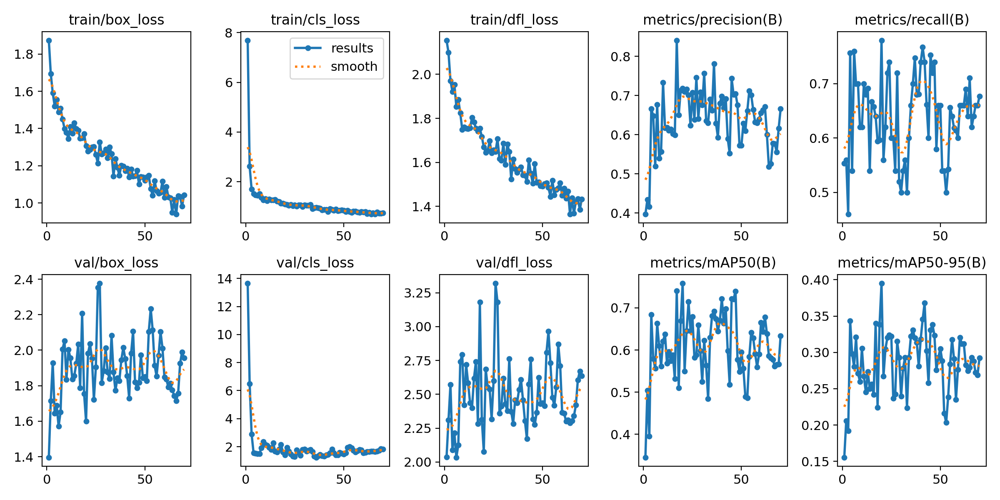
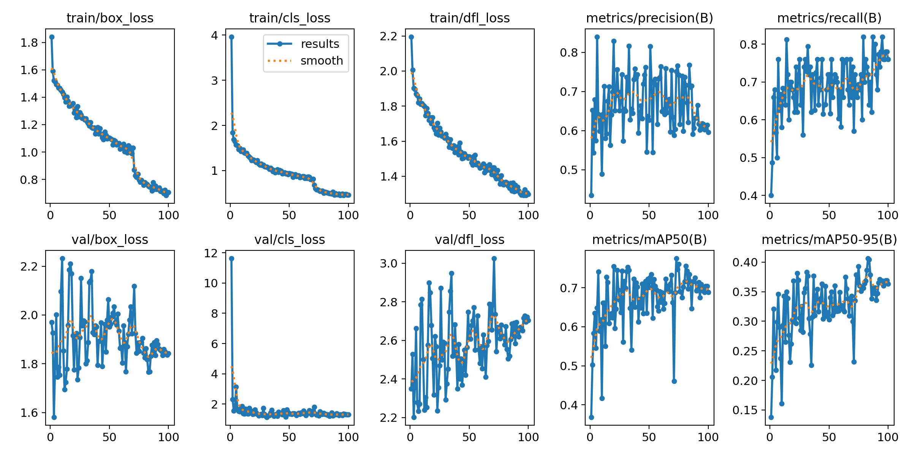

# Cat Detection — YOLOv8

Single-class object detection system for localising cats in images, fine-tuned on a custom dataset using the YOLOv8 architecture.

---

## Project Structure

```
cat_detection/
├── README.md
├── requirements.txt
├── data/
│   ├── train/images/        # 556 images (139 original + 417 augmented)
│   ├── train/labels/
│   ├── valid/images/        # 43 images
│   ├── valid/labels/
│   └── data.yaml
├── weights/
│   ├── yolov8m_best.pt      # Model 1 — higher accuracy
│   └── yolov8s_augmented_best.pt  # Model 2 — faster inference
├── train.py
├── evaluate.py
├── infer.py
└── utils/
    ├── augment.py
    └── visualize.py
```

---

## Methodology and Approach

### Model Selection
YOLOv8 (Ultralytics) was selected for its anchor-free detection head, Distribution Focal Loss for tighter bounding boxes, and strong transfer learning capability from COCO-pretrained weights. Two model variants were trained and compared:

| | YOLOv8m | YOLOv8s + Augmentation |
|---|---|---|
| Parameters | 25.8M | 11.1M |
| Training images | 139 | 556 |
| Epochs | 63 (early stop) | 100 |

### Training Pipeline
1. **Data audit** — verified label format, checked for missing annotations, identified bounding box size distribution
2. **Baseline training** — YOLOv8m on original 139 images with SGD optimizer
3. **Diagnosis** — early stopping at epoch 1/13 indicated overfitting due to small dataset relative to model capacity
4. **Augmentation** — offline augmentation via Albumentations (random rotation, flips, brightness/contrast, HSV jitter, Gaussian noise, blur) expanded training set to 556 images (4× increase)
5. **Retraining** — YOLOv8s on augmented dataset with AdamW optimizer, lower learning rate (0.0003), frozen backbone (first 9 layers), dropout regularisation

### Key Hyperparameters
```
optimizer:      AdamW
lr0:            0.0003
warmup_epochs:  10
freeze:         9          # backbone frozen
dropout:        0.25
batch:          16
imgsz:          640
mosaic:         1.0
close_mosaic:   30
```

---

## Assumptions

- All labelled instances in the dataset are cats (single class, verified via audit)
- Bounding boxes covering >95% of frame (19 training, 6 validation) are legitimate close-up shots, not annotation errors
- Validation set (43 images) is representative of deployment distribution
- CC BY 4.0 licensed Roboflow dataset is acceptable for commercial interview use

---

## Model Performance and Results

### Quantitative Results

| Metric | YOLOv8m (best.pt) | YOLOv8s Augmented (best.pt) |
|--------|:-----------------:|:---------------------------:|
| Precision | 0.612 | 0.620 |
| Recall | 0.800 | 0.717 |
| mAP@50 | **0.796** | 0.697 |
| mAP@50-95 | **0.427** | 0.406 |
| Inference speed | 29.3 ms/img | **17.8 ms/img** |
| Model size | 52.0 MB | 22.5 MB |

### Training Curves — YOLOv8m (139 images)



Training losses decrease steadily. Validation losses plateau early due to limited dataset size (139 images), causing noisy validation metrics — a direct consequence of the small validation set (43 images), where a single misprediction shifts metrics significantly.

### Training Curves — YOLOv8s + Augmentation (556 images)



All three training losses (box, cls, dfl) decrease smoothly across 100 epochs. Validation cls loss stabilises. mAP50-95 shows an upward trend throughout, indicating the model was still learning at epoch 100 and would benefit from extended training.

### Model Selection Recommendation
- **Accuracy-critical use case** → use `yolov8m_best.pt` (mAP50: 0.796)
- **Speed-critical / edge deployment** → use `yolov8s_augmented_best.pt` (17.8ms, 2.3× faster, 57% smaller)

---

## Challenges Encountered

**1. Small dataset (139 training images)**
The primary challenge throughout. YOLOv8m (25.8M parameters) memorised the training set within 1–13 epochs consistently, producing noisy validation curves and early stopping triggers. Standard mitigation techniques (frozen backbone, dropout, lower LR) provided partial relief but could not fully compensate for data scarcity.

**2. Noisy validation metrics**
With only 43 validation images and 50 instances, a single false positive or missed detection produces outsized swings in precision/recall/mAP. This makes it difficult to distinguish genuine model improvement from statistical noise epoch-to-epoch.

**3. Model capacity vs data size mismatch**
YOLOv8m was oversized for 139 images. Switching to YOLOv8s reduced overfitting but at the cost of representational capacity. The ideal model size sits between these two given the dataset.

**4. Early stopping behaviour**
Default patience=20 caused training to terminate at epoch 21 before the model could generalise. Disabling early stopping (patience=0) and training for full 100–300 epochs was necessary to observe meaningful learning.

---

## Suggestions for Future Improvements

**1. Collect more data (highest impact)**
A minimum of 500–1000 diverse training images would allow YOLOv8m or larger to train properly without aggressive regularisation constraints. Diversity in pose, lighting, breed, and background is more valuable than volume alone.

**2. Pseudo-labelling / semi-supervised learning**
Use the current best.pt to generate predictions on unlabelled cat images, manually verify high-confidence detections, and add them to the training set iteratively.

**3. Extended training with cosine LR schedule**
The YOLOv8s augmented model showed mAP still rising at epoch 100. Training for 200–300 epochs with cosine annealing would likely push mAP50 above 0.75.

**4. Test-Time Augmentation (TTA)**
Enable TTA during inference (`augment=True` in predict) to improve mAP50 by 2–4% at the cost of 3× inference time.

**5. Hyperparameter search**
Automated search (Optuna or YOLOv8 built-in tuner) over lr0, dropout, freeze depth, and augmentation parameters would likely yield 3–5% mAP improvement without any additional data.

**6. Export to ONNX / TensorRT**
For production deployment, exporting to ONNX reduces inference latency further. TensorRT on the T4 GPU would push well below 10ms/image.

```python
model.export(format='onnx')   # cross-platform
model.export(format='engine') # TensorRT, maximum speed
```

---

## Environment

```
Python      3.12.13
PyTorch     2.11.0+cu128
Ultralytics 8.4.56
CUDA        Tesla T4 (14913 MiB)
```

## Installation

```bash
pip install ultralytics albumentations opencv-python matplotlib
```

## Quick Inference

```bash
python infer.py --source path/to/images --weights weights/yolov8m_best.pt --conf 0.25
```
